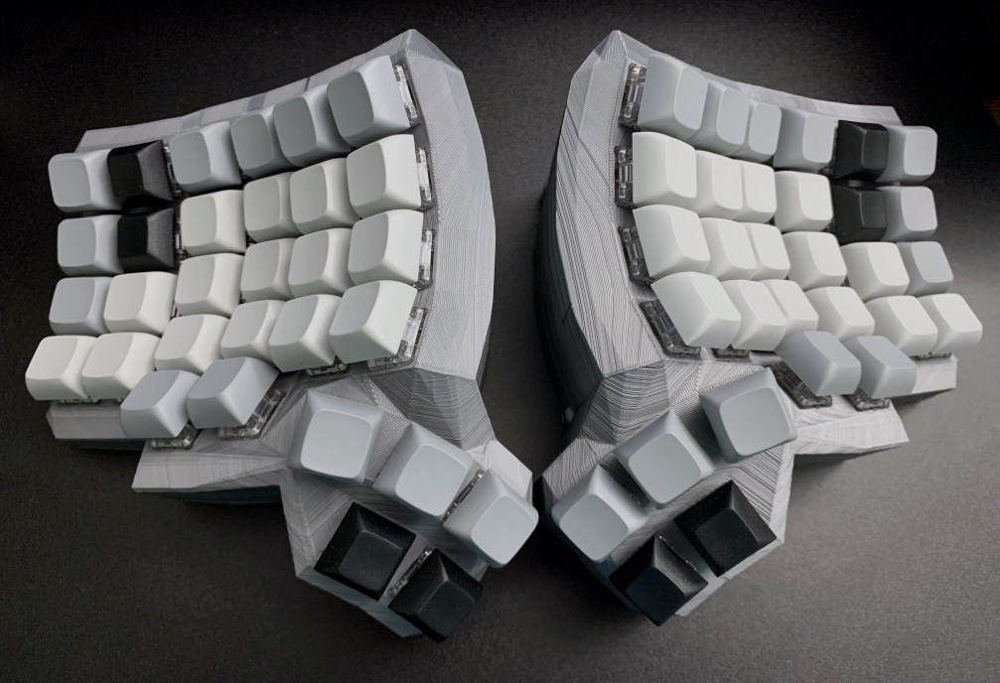
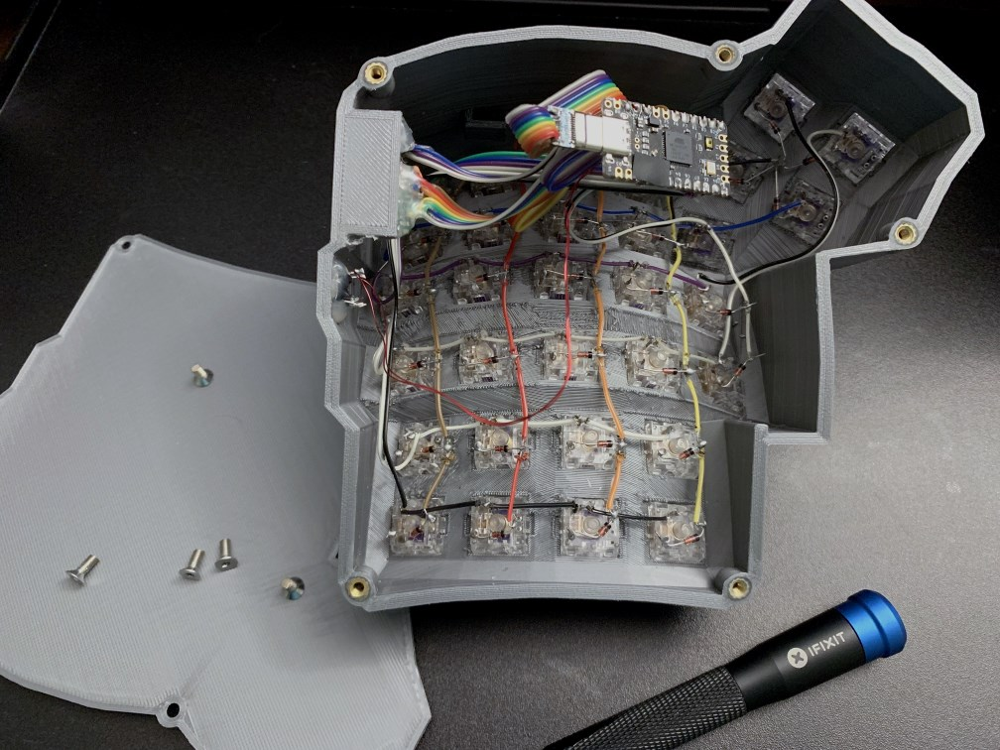

# Dactyl ManuForm Mini Keyboard

This is a fork of the [Dactyl-ManuForm-Mini](https://github.com/l4u/dactyl-manuform-mini-keyboard). The Dactyl-ManuForm-Mini is a fork of the [Dactyl-ManuForm](https://github.com/tshort/dactyl-keyboard), which is a fork of the [Dactyl](https://github.com/adereth/dactyl-keyboard) with the thumb cluster from [ManuForm](https://github.com/jeffgran/ManuForm).

## Features

Major changes from the Dactyl Manuform Mini:

- Models for bottom plates have been added, so these can now be printed.
- The tenting angle has been greatly increased, and the overall height has been increased to support the steeper angle.
- Pinky keys are standard width (1U) by default.
- Key columns are more evenly spaced and optimized for my hands.
- Sidenubs are disabled by default, and the top surface thickness for the switch retention tabs has been reduced. In my prints, keys now snap in firmly without sidenubs, but can still be easily removed with a switch puller.
- The back row of thumb keys has been lowered to prevent accidental keypresses.
- The USB-C jack cutout has been rounded to fit more snugly.
- USB and TRRS jacks have been repositioned.
- Some example QMK keymaps been added.

## Generate OpenSCAD and STL Models

- Run `lein generate` or `lein auto generate`
- This will regenerate the `things/*.scad` files.
- Use OpenSCAD to open a `.scad` file.
- Make changes to design, repeat `load-file`, OpenSCAD will watch for changes and rerender.
- When done, use OpenSCAD to export STL files.

## Configure / Load QMK Firmware

To get started, visit the [QMK configurator](https://config.qmk.fm/#/handwired/dactyl_manuform/5x6_5/LAYOUT_5x6_5) - it already has the Manuform Mini keyboard/layout (`handwired/dactyl_manuform/5x6_5`). Use the default keymap or start with one of the ones included here. Once your keymap is ready, export to save the JSON (bottom left), click COMPILE (top right), then FIRMWARE (bottom right) to download the .hex file. Download and run the [QMK Toolbox](https://github.com/qmk/qmk_toolbox/releases), connect one half via USB, reset the microcontroller, flash the .hex file, and repeat.

Some modifications will require downloading and compiling the firmware source yourself, but I never needed to.

## Build Notes

Special thanks to Jesse at [diykeyboards.com](https://www.diykeyboards.com/) for sending me a pair of Elite C's (at no additional charge) when they ran out of Pro Micros.

Some useful parts:

- This [Manuform hardware kit](https://www.diykeyboards.com/cases/product/dmf-hardware-kit). I used the included wire for the first half (see above) before switching to enamelled.
- Of the various wiring options, I found [enamelled wire](https://amzn.com/gp/product/B07DYF53ZN) to be the least painful. The primary issue I ran into was getting the enamel layer to melt. Most of the time I was able to simply solder the coated wire directly and get a solid physical/electrical connection, but sometimes the coating prevented the wire from bonding. Increasing the iron temperature helped, but pre-melting the coating (or better, filing the coating off) was necessary more than once.
- This [USB-C jack](https://amzn.com/dp/B01787M014), though following the given pinout I could only connect the cable in one orientation, and had to file down the board on both sides of the jack.
- This [3.5mm audio cable](https://amzn.com/dp/B01K3WYJBK) for connecting the halves.
- Quality keycaps can be expensive - [this DSA set](https://amzn.com/dp/B07S18VCDN) and [this XDA set](https://amzn.com/dp/B07TKX26HVY) worked well for me. I ended up keeping both and mixing them to get the profiles I wanted in different locations.

## Things To Consider

Adapting to this style of keyboard (split, ortholinear, highly tented, different layout driven by thumb keys) is more of a challenge than I anticipated. If you are hoping to type just as fast or faster with a theoretically more optimal key layout, it may take longer than you expect. This is doubly true while you are tweaking the keymap - each change will force fresh mistakes and a relearning period.

That said, the ergonomic improvements are undeniable. Typing would likely be faster and less error prone with a smaller tenting angle, but obviously it would be somewhat less ergonomic.

Also, if you are new to 3D printing, you may find the costs and hassle of getting good prints more than you bargained for. If you want to tweak the model and test how it fits your hands or typing style, there's no substitute for the ability to print out and test your changes. If you are planning to use models as-is (or the changes are small enough that the 3D view is sufficient), consider getting it professionally printed instead.

## Todos / Future Changes

- Move the pinky columns backwards, to the original Manuform Mini Y-position. After my first test prints, I moved these forward as I found the arrangement awkward - keys can be shifted almost a full row vertically between columns - but ultimately it just takes some getting used to. Currently I rest my pinky fingers on the last row, which is comfortable but suboptimal for the keymap and reaching the furthest keys.
- The TRRS jack cutout00 isn't recessed far enough and I had to shave mine down to fit. I kept the [original squared style](https://www.diykeyboards.com/parts/product/pj320a) as I had a pair of jacks I wanted to use up. I'd like to adopt [this style of jack](https://amzn.com/dp/B01C3RFHDC) as is [used here](https://github.com/bstiq/dactyl-manuform-mini-keyboard) instead.
- There's currently no cutout for reset switches, I just drilled holes.
- For my build: use [Kaihl hotswap sockets](https://www.diykeyboards.com/parts/product/kailh-hotswap-pcb-sockets-10pcs).

## License

Copyright © 2015-2021 Matthew Adereth, Tom Short, Leo Lou, and Matt Davis

The source code for generating the models is distributed under the [GNU AFFERO GENERAL PUBLIC LICENSE Version 3](LICENSE).

The generated models are distributed under the [Creative Commons Attribution-ShareAlike 4.0 International (CC BY-SA 4.0)](LICENSE-models).
